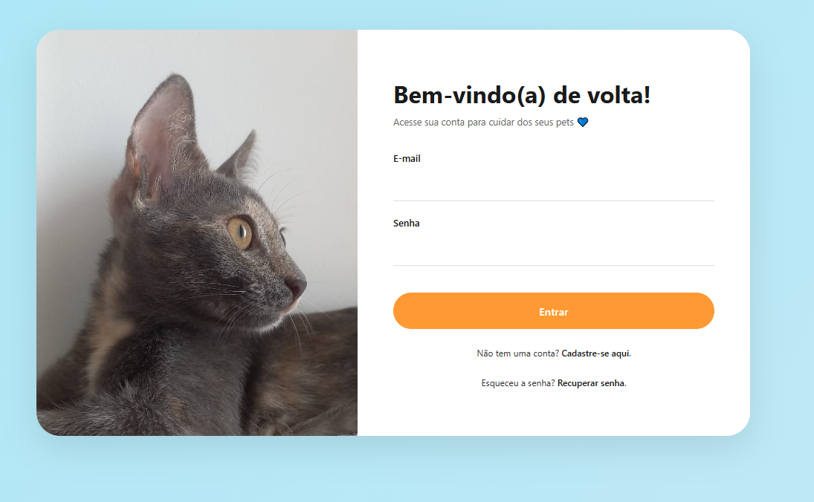
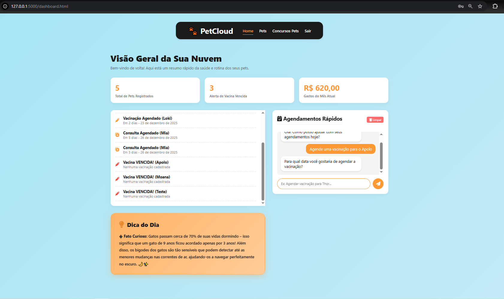

PetCloud - Sistema de Gestão e Comunidade para Pets

## Menu de Autenticação


## Home do Sistema



## INSTRUÇÕES DE NAVEGAÇÃO:

### 1. Arquivo Inicial
- Abrir em um navegador: **`index.html`**
- Este arquivo contém a Landing Page / Home do sistema

### 2. Fluxo de Navegação Recomendado

| Etapa | Arquivo | Descrição |
|-------|---------|-----------|
| 1 | `index.html` | Landing Page (Página 1) |
| 2 | `cadastro.html` | inscrição no sistema (Página 2) |
| 3 | `login.html` | Autenticação (Página 3) |
| 4 | `recuperar-senha.html` | Recuperação de senha (Página 4) |
| 5 | `dashboard.html` | DashboardpPrincipal (Página 5) |
| 6 | `listagem.html` | lista de pets do usuário (Página 6) |
| 7 | `detalhes.html` | detalhamento do pet 1 (Página 7) |
| 8 | `detalhes-mimi.html` | detalhamento pet 2 (Página 8) |
| 9 | `concurso.html` | comunidade de desafios e votações de pets.(Página 9) |

---

## Observações Relevantes

### 🛠️ Tecnologias Utilizadas
- HTML5 semântico
- CSS3 responsivo

### 📱 Responsividade
- Todas as páginas responsivas para desktop, tablet e mobile

### 📂 Estrutura do Projeto

PetCloud/
├── index.html
├── cadastro.html
├── concurso.html
├── dashboard.html
├── detalhes.html
├── detalhes-mimi.html
├── listagem.html
├── login.html
├── recuperar-senha.html
└── css/
    ├── style.css
├── imagens/
└── video/


## 🔧 Configuração e Instalação

### Pré-requisitos
- Python 3.8 ou superior
- pip (gerenciador de pacotes Python)
- Navegador moderno (Chrome, Firefox, Edge)

### Passo a Passo

1. **Clone o repositório**
   ```bash
   git clone https://github.com/MarinaPrivado/PetCloud-project.git
   cd PetCloud-project
   ```

2. **Instale as dependências Python**
   ```bash
   cd backend
   pip install -r requirements.txt
   ```

3. **Configure as variáveis de ambiente**
   
   Crie um arquivo `.env` na pasta `backend/` com o seguinte conteúdo:
   ```env
   # OpenAI GPT API
   OPENAI_API_KEY=sua_chave_openai_aqui
   
   # Flask Secret Key
   SECRET_KEY=sua_chave_secreta_aqui
   
   # Google Cloud (para envio de emails)
   GOOGLE_CLIENT_ID=seu_client_id_aqui
   GOOGLE_CLIENT_SECRET=seu_client_secret_aqui
   GOOGLE_REFRESH_TOKEN=seu_refresh_token_aqui
   ```
   
   **Como obter as chaves:**
   - **OpenAI API**: Acesse [platform.openai.com](https://platform.openai.com/api-keys)
   - **Google Cloud**: Configure OAuth 2.0 no [Google Cloud Console](https://console.cloud.google.com/apis/credentials)
   - **Secret Key**: Gere com `python -c "import secrets; print(secrets.token_hex(32))"`

4. **Configure o banco de dados**
   ```bash
   python setup_database.py
   ```
   
   Este script irá:
   - Criar todas as tabelas necessárias
   - Popular com dados iniciais de exemplo
   - Criar 2 usuários de teste (credenciais exibidas ao final)

5. **Inicie o servidor**
   ```bash
   cd src
   python app.py
   ```
   
   O servidor iniciará em `http://127.0.0.1:5000`

6. **Acesse a aplicação**
   
   Abra no navegador: `http://127.0.0.1:5000/pages/index.html`
   

---

### 🚀 Próximos Passos (Fora do escopo MVP)
- Sistema de notificações real-time
- Inclusão de outras páginas(Adicionar novo pet; registro de gastos;historico completo)

---

> **Nota**: Para dúvidas sobre navegação, consulte o PRD (Product Requirements Document) fornecido com este projeto.
